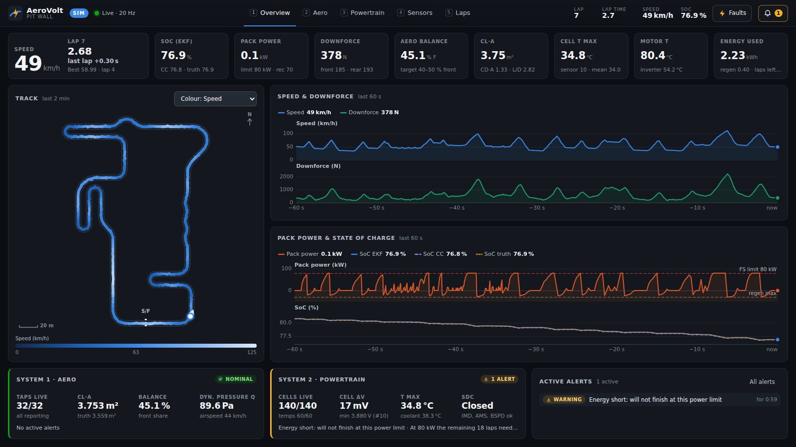
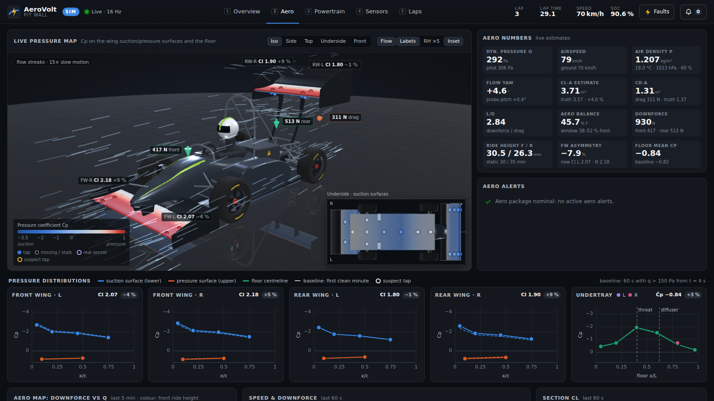
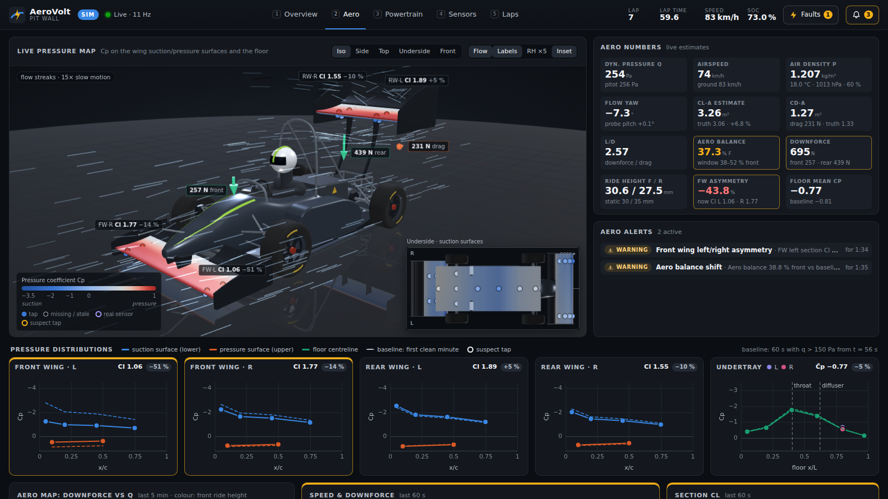
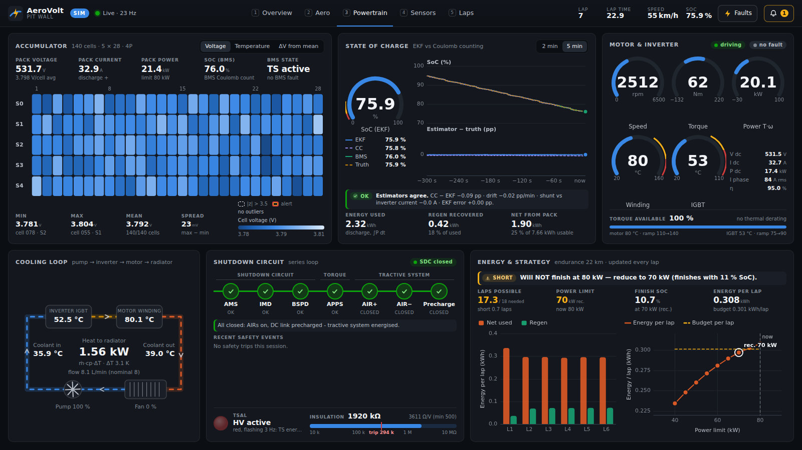
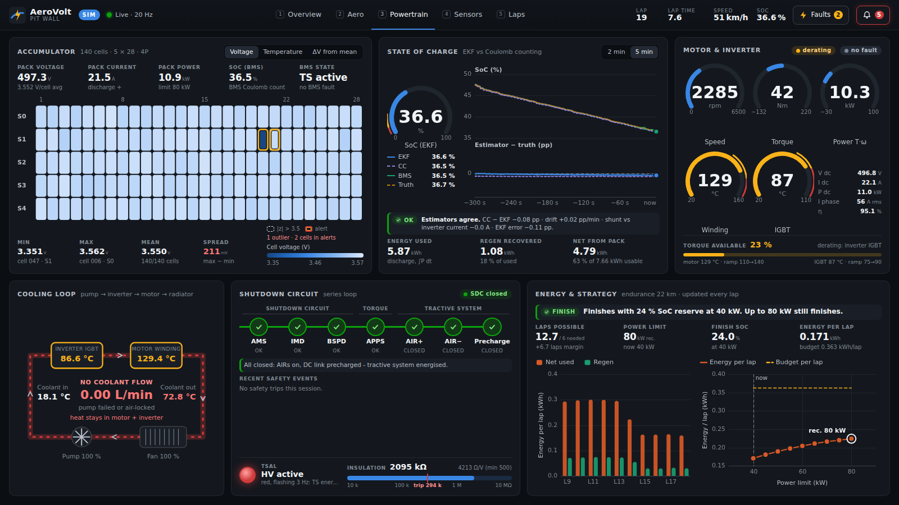
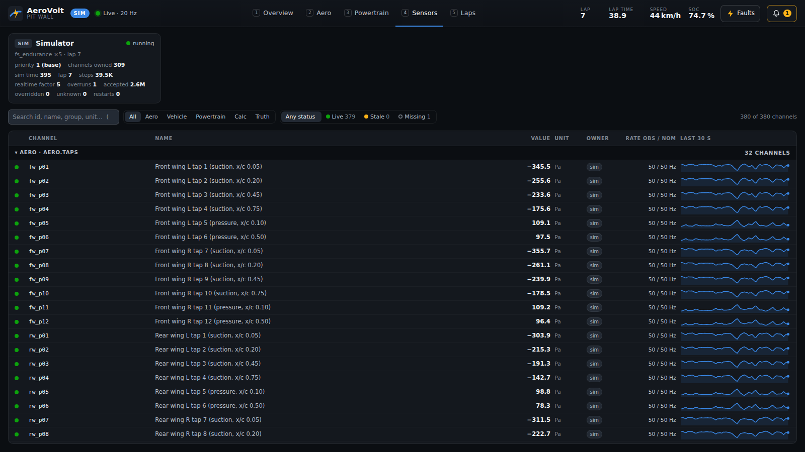
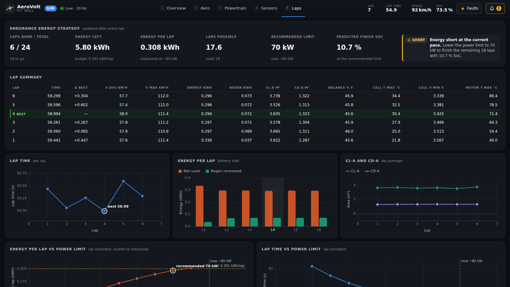
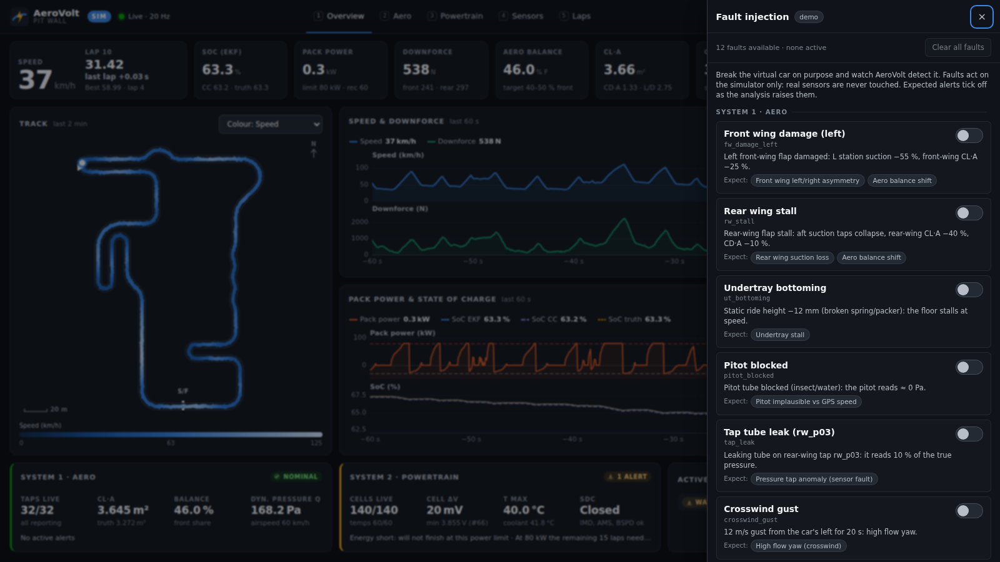
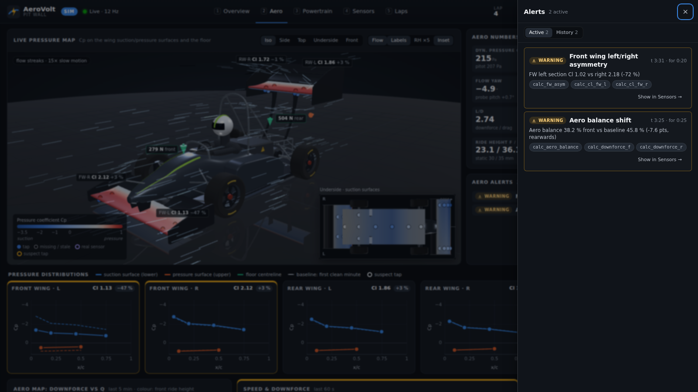

# AeroVolt

**Telemetry and analysis for a Formula Student electric race car.**

AeroVolt reads the sensors of the car, turns them into engineering numbers with real physics,
and shows everything live in a web dashboard on the pit wall. It watches two systems:

| | System 1 – **Aero sensing** | System 2 – **EV powertrain sensing** |
|---|---|---|
| Sensors | 32 wing / undertray pressure taps, pitot tube, ambient air (BME280), 5-hole probe, laser ride height, wing load cells, pushrod load cells, IMU, GPS | motor, inverter, accumulator (every one of the 140 cells: voltage, 60 temperature sensors), BMS, cooling loop, shutdown circuit |
| Results | Cp maps, section Cl, downforce front/rear, drag, CL·A, CD·A, aero balance, L/D | state of charge (Coulomb counting **and** an extended Kalman filter), energy per lap, endurance strategy, inverter efficiency, heat rejected |
| Diagnosis | **sensor fault vs real aero problem** (a leaking tap is not a broken wing) | thermal, cell, insulation and safety-chain alerts |

With no car it runs in **demo mode**: a physics simulator drives a virtual car around a
Formula Student endurance track and produces every sensor signal (with realistic noise, lag
and faults you can inject). With a real car you change one config file and the same dashboard
shows real data from **USB-serial sensor nodes** or the **CAN bus**. Both can run together
(**HYBRID**): one real pressure sensor on the bench drives one tap of the virtual car.

> Everything here is in this repository: the simulator, the analysis, the web dashboard, the
> sensor-node firmware (C++, Teensy / ESP32 / Arduino Nano), the CAN database (DBC) and about
> 600 automated tests.

---

## Contents

1. [Screenshots](#1-screenshots)
2. [Quick start](#2-quick-start)
3. [5-minute competition demo](#3-five-minute-competition-demo)
4. [Phase 2: real sensors, step by step](#4-phase-2-real-sensors-step-by-step)
5. [How it works](#5-how-it-works)
6. [The physics (with formulas)](#6-the-physics)
7. [Project structure](#7-project-structure)
8. [How to add a new sensor](#8-how-to-add-a-new-sensor)
9. [Testing](#9-testing)
10. [Safety notes](#10-safety-notes)
11. [Roadmap](#11-roadmap)

---

## 1. Screenshots

All images are from the real backend (`python -m aerovolt`), not a mock-up.

**Overview** – speed, lap delta to the best lap, SoC (EKF vs Coulomb counting vs simulator
truth), downforce, aero balance, CL·A, track map coloured by speed, health of both systems.



**Aero** – live 3D car with the measured pressure map (blue = suction, red = pressure), flow
streaks, downforce and drag arrows, Cp distribution of every wing station against its learned
baseline, the aero map (downforce vs q) and the section-Cl history.



**Aero with a fault** – `fw_damage_left` injected: the left front-wing station loses suction, the
section Cl of FW·L drops about 50 % against its baseline (red), the balance moves rearwards,
and the analysis raises *front-wing asymmetry* and *aero balance shift*.



**Powertrain** – the 140-cell accumulator map (voltage / temperature / ΔV), state of charge,
motor and inverter, cooling loop schematic, shutdown circuit, and the energy strategy.



**Powertrain with faults** – `cell_hot` (cell 47 has a bad weld: 4× resistance) and `pump_fail`
(coolant pump stopped): the hot cell stands out in the cell map, the cooling loop shows **NO
COOLANT FLOW**, the motor winding heats up and the inverter derates.



**Sensors** – every channel (380): live value, owner (sim / serial / CAN / replay), measured
vs nominal rate, status (live / stale / missing) and a 30 s sparkline.



**Laps** – lap table with energy, CL·A, CD·A, balance and temperatures per lap, plus the
endurance strategy: energy per lap vs power limit from the lap simulator.



**Fault injection** (the simulator only – real sensors are never touched) and the **alerts**
drawer, where every alert names its evidence:





---

## 2. Quick start

You need **Python 3.10 or newer**. Everything runs on Windows, macOS and Linux. All commands
are run from this folder (the one that contains this README).

```bash
# 1. create and activate a virtual environment (once)
python -m venv .venv
source .venv/bin/activate            # Windows: .venv\Scripts\activate

# 2. install the dependencies (numpy, pyyaml, aiohttp)
pip install -r requirements.txt
#    for real sensors (CAN, USB serial) and for the full test suite, also:
pip install -r requirements-dev.txt

# 3. run the demo (simulator) and open the dashboard
python -m aerovolt --open
#    or open http://127.0.0.1:8080 in Chrome / Edge / Firefox yourself
```

Useful options:

| Command | What it does |
|---|---|
| `python -m aerovolt --speed 4` | simulator at 4× real time (a lap every ~15 s) |
| `python -m aerovolt --fault cell_hot@120` | inject a fault at t = 120 s |
| `python -m aerovolt --track skidpad` | other tracks: `fs_endurance` (default), `skidpad`, `acceleration` |
| `python -m aerovolt --log logs/run1.csv.gz` | record a data log (CSV, opens in Excel/MATLAB) |
| `python -m aerovolt --config config/replay.yaml` | replay a log through the analysis |
| `python -m aerovolt --headless --duration 600 --speed max` | no browser: run 10 minutes as fast as possible and print a summary |
| `python -m aerovolt --list-faults` / `--list-tracks` | what can be injected / driven |
| `python -m aerovolt --host 0.0.0.0` | let other laptops and phones on the network connect |

Keyboard shortcuts in the dashboard: **1–5** switch tabs, **F** opens fault injection, **A**
opens the alerts.

---

## 3. Five-minute competition demo

Start the server a minute before the judges arrive, so the car has driven one lap and the
analysis has learned its baselines:

```bash
python -m aerovolt --speed 2 --open
```

| Time | Click | Say |
|---|---|---|
| 0:00 | **Overview** tab | "This is AeroVolt. It watches two systems of our electric car: the aerodynamics and the high-voltage powertrain. Right now it runs from a physics simulator of our car on a 950 m Formula Student endurance track, but the dashboard does not know that – it gets the same sensor signals a real car sends: 298 raw channels, from 32 pressure taps to all 140 cell voltages." |
| 0:40 | Point at **SoC** tile and the SoC chart | "State of charge is estimated twice: Coulomb counting integrates the current, the Kalman filter also uses the cell voltages. The dotted line is the simulator's truth – the EKF stays within a few tenths of a percent." |
| 1:00 | **Aero** tab (key 2) | "This is the live pressure map. Each dot is a pressure tap; the colour is the pressure coefficient Cp = p / q, where q is the dynamic pressure from the pitot tube. Blue is suction on the underside of the wings – that is what pushes the car down. From the taps we integrate the section lift coefficient of each wing station; from the pushrod load cells we get the real downforce, and dividing by q gives CL·A, our main aero number." Drag the 3D car to rotate it; click **Underside** to see the floor. |
| 1:50 | Press **F**, switch on **Front wing damage (left)**, close the drawer | "Now I break the left front-wing flap. Watch the FW·L Cp curve fall off its dashed baseline, the asymmetry tile turn red, and the balance move rearwards." After ~10 s the alerts appear: *front-wing asymmetry*, then *aero balance shift*. Switch the fault off. |
| 2:40 | **F** → **Tap tube leak (rw_p03)** | "Is every strange reading a broken wing? No. Here one pressure tube leaks. Only one tap deviates and its neighbours are normal – real flow changes are never that local. So AeroVolt classifies it as a **sensor fault**, not an aero problem, and leaves that tap out of the Cl integral." Open the alerts (**A**) and click **Show in Sensors**: the Sensors tab opens filtered to `rw_p03`. Switch the fault off. |
| 3:20 | **Powertrain** tab (key 3), **F** → **Current sensor offset** | "A +3 A offset on the pack current sensor. Coulomb counting trusts the current, so it drifts 0.3 % per minute. The EKF corrects with the cell voltages and stays on the truth. When they disagree, AeroVolt raises *SoC divergence* – and the card even estimates the offset from the drift." |
| 4:00 | **Laps** tab (key 5) | "Endurance strategy. 22 km is 24 laps. From the energy per lap measured so far and our quasi-steady-state lap simulator, AeroVolt predicts that at the full 80 kW we run out of energy before the end – so it recommends the highest power limit that still finishes with the reserve. Lap time barely changes, because this track is limited by grip, not power." |
| 4:40 | **Sensors** tab (key 4) | "Every channel has an owner, a measured rate and a status. If a sensor dies, its value goes stale – it is never frozen. For Phase 2 one real sensor replaces a simulated one, and this column says *serial*." |

Questions judges like, and where the answer is:

* *How do you know the estimates are right?* – Simulator truth channels (`truth_*`) are shown
  next to every estimate, and the test suite checks EKF and CL·A against them.
* *Why a Kalman filter?* – [§6.6](#66-state-of-charge-coulomb-counting-and-the-ekf).
* *Is it connected to the shutdown circuit?* – No, never: [§10](#10-safety-notes).

---

## 4. Phase 2: real sensors, step by step

The full hardware guide (parts list with prices, wiring, tubing, sensor ranges, CAN rules,
troubleshooting) is **[docs/HARDWARE.md](docs/HARDWARE.md)**. In short:

### 4.1 Bench demo: one real pressure sensor on the virtual car

Parts: Arduino Nano (or Teensy 4.1 / ESP32), one Sensirion SDP810/SDP31 differential pressure
sensor, a BME280, 20 cm of silicone tube.

1. Wire the sensor (I²C) as in HARDWARE.md §3.1.
2. Flash the firmware: `cd firmware/sensor_node && pio run -e nano_serial -t upload`
   (profile `NODE_PROFILE_BENCH_ONE_TAP` in `include/node_config.h`).
3. Check it: `pio device monitor -b 115200` shows lines like
   `$AV,BENCH,52,fw_p03=-412.5*7F` (50 per second). Close the monitor.
4. Zero it with no airflow: `python tools/calibrate_taps.py --port auto`
   (writes the offset to `config/calibration.yaml`; it refuses if the air is moving).
5. Run: `python -m aerovolt --config config/hybrid_serial.yaml --open`.
6. The header says **HYBRID**. On the Aero tab, tap 3 of the left front wing has a ring
   ("USB-serial sensor"). Blow into the tube: the tap turns red (pressure), suck: blue
   (suction), and the section Cl reacts – while the virtual car keeps lapping.
7. Pull the USB cable: after 1 s the simulated value comes back (the source shows *waiting*);
   plug it in again and it reconnects within 2 s.

The rule behind this: sources are listed in priority order in the config, **later sources
win**, and a value from a lower-priority source is dropped while a higher-priority source has
sent that channel in the last 1.0 s.

### 4.2 The same demo without any hardware

```bash
python tools/fake_sensor_node.py --pty --pattern blow
```

It creates a virtual serial port, prints its path and the exact command to start AeroVolt
with a ready-made copy of `hybrid_serial.yaml`. Press **Enter** to "blow" on the sensor.
Other patterns: `steady`, `sweep`, `drive` (Cp × ½ρv² from a lap-like speed trace). Try
`--offset fw_p03=3.4` (a zero error for `calibrate_taps.py` to find) or `--fail-at 20`
(the sensor stops answering for 3 s: the node reports it and sends `nan`, so the value is never
frozen, and the tap shows as missing).

### 4.3 On the car: CAN bus

1. Every node on the car's CAN bus (1 Mbit/s, 11-bit IDs) sends the frames of
   `can/aerovolt.dbc`. The DBC is generated from `config/can_layout.yaml` – the **signal name
   is the channel id**. The firmware gets the same layout as a C++ header
   (`firmware/sensor_node/include/aerovolt_can.h`).
2. Install the hardware packages: `pip install -r requirements-hw.txt`.
3. Linux with a CAN adapter: `sudo ip link set can0 up type can bitrate 1000000`.
4. Set the start/finish gate (two GPS points) in `config/car_can.yaml` → `laps.gate`.
5. Run: `python -m aerovolt --config config/car_can.yaml --host 0.0.0.0` – mode **LIVE**.
   Every run is logged to `logs/car_<timestamp>.csv.gz`.

No adapter? Create a virtual bus (`sudo ip link add dev vcan0 type vcan && sudo ip link set
vcan0 up`), set `channel: vcan0`, and feed it with `python tools/fake_sensor_node.py --can vcan0`.

"Signal not available" (SNA): a sender that has no value for a signal sends the reserved raw
value (0x8000 for signed, all ones for unsigned signals). AeroVolt drops SNA values, so a
missing sensor never overwrites a real reading with a fake number.

---

## 5. How it works

```
 DATA SOURCES (aerovolt/sources, aerovolt/sim)          priority: later in the config wins
 ┌──────────────┐ ┌───────────────┐ ┌──────────────┐ ┌──────────────┐
 │ SimSource    │ │ SerialSource  │ │ CanSource    │ │ ReplaySource │
 │ physics sim  │ │ $AV lines     │ │ DBC decode,  │ │ CSV log      │
 │ 100 Hz       │ │ USB / pty     │ │ SNA dropped  │ │ playback     │
 └──────┬───────┘ └──────┬────────┘ └──────┬───────┘ └──────┬───────┘
        └────────────────┴───────┬─────────┴────────────────┘
                                 ▼  emit(t, {channel: value})
                   ┌──────────────────────────────┐
                   │ SourceManager  core/manager  │  priority merge (1 s override window),
                   │                              │  calibration of hardware values,
                   └──────────────┬───────────────┘  owner of every channel, restarts
                                  ▼
                   ┌──────────────────────────────┐
                   │ ChannelStore   core/store    │  latest value + timestamp per channel,
                   │                              │  20 Hz history ring buffer (300 s)
                   └──────────────┬───────────────┘
                                  ▼  every 50 ms of DATA time (20 Hz)
                   ┌──────────────────────────────┐
                   │ Processor  analysis/         │  aero.py  soc.py  powertrain.py
                   │  writes 71 calc_* channels   │  laps.py  strategy.py  anomaly.py
                   │  returns alert/lap/strategy  │  alerts.py (rules in alerts.yaml)
                   └──────────────┬───────────────┘
                                  ▼
                   ┌──────────────────────────────┐        ┌───────────────────────┐
                   │ Session  server/session.py   │───────▶│ LogWriter  datalog/   │
                   │ EventBus, faults timeline    │        │ CSV(.gz) + meta.json  │
                   └──────────────┬───────────────┘        └───────────────────────┘
                                  ▼
                   ┌──────────────────────────────┐   WebSocket /ws: hello, frame (20 Hz),
                   │ aiohttp server  server/app   │   alert, lap, strategy, faults, sources
                   └──────────────┬───────────────┘   REST /api/... (history, faults, laps)
                                  ▼
                   ┌──────────────────────────────┐
                   │ Web dashboard  web/          │   ES modules, no build step, three.js
                   │ Overview Aero Powertrain     │   (vendored: works offline at a track)
                   │ Sensors Laps                 │
                   └──────────────────────────────┘
```

Key ideas:

* **One channel catalogue** (`config/sensors.yaml`) is the single source of truth: 298 raw
  channels, 71 calculated (`calc_*`) and 11 simulator-truth (`truth_*`) channels, each with
  unit, rate, range, noise and thresholds. The simulator, CAN layout, analysis, logger and
  dashboard all read it.
* **Data time drives the analysis**, not the wall clock – so a simulation at `--speed max`
  or a replayed log is analysed exactly like a live session. A 1 Hz wall-clock tick still
  runs for real sources, so a sensor that goes quiet becomes *stale*.
* **The analysis never reads the simulator's truth.** It only uses what a real car would
  measure; `truth_*` channels are for display and for tests.
* **Missing data is NaN, never a frozen number.** A dead sensor goes stale after
  `max(0.5 s, 5 / rate)`; the processor treats stale inputs as NaN (NaN in → NaN out).
* The **simulator** (`aerovolt/sim`) runs at 100 Hz: driver model following the lap-sim speed
  profile, point-mass chassis with load transfer and suspension, aero model with ground
  effect, stall and yaw, motor + inverter + 140 cell models + cooling loop + safety chain,
  and a virtual sensor for every channel (catalogue rate, first-order lag, Gaussian noise,
  quantisation, clipping). It runs about 50× real time on one core (the full pipeline with
  the analysis about 15×).

---

## 6. The physics

All formulas live in clearly named, documented functions (`aerovolt/core/physics.py`,
`aerovolt/analysis/*.py`); the docstrings explain each one in more detail.

### 6.1 Air density (moist air)

Humid air is lighter than dry air. With the BME280's temperature *T* (K), absolute pressure
*p* and relative humidity *RH*:

```
p_sat = 610.94 · exp(17.625 · T_c / (T_c + 243.04))      Magnus formula, T_c in °C, Pa
p_v   = RH · p_sat                                        vapour partial pressure
ρ     = (p − p_v) / (R_d · T) + p_v / (R_v · T)           R_d = 287.06, R_v = 461.50 J/(kg·K)
```

### 6.2 Dynamic pressure and airspeed

The pitot tube measures total − static pressure, which is the dynamic pressure *q*:

```
q = ½ · ρ · V²          →     V_air = √(2 q / ρ)
```

Airspeed ≠ ground speed when there is wind – that is why the pitot is needed. If the pitot
is missing or flagged implausible (blocked), *q* falls back to ½ρ·V_gps².

### 6.3 Pressure coefficient and section lift

Each tap measures local static pressure minus freestream static pressure, so

```
Cp = (p_local − p_∞) / q        (only when q > 60 Pa; below that, noise dominates)
```

Cp = 1 at a stagnation point; Cp < 0 is suction. On an *inverted* wing the suction surface is
the **lower** surface. The sectional downforce coefficient of a wing station is the chordwise
integral of the pressure difference between the two surfaces:

```
Cl = ∫₀¹ (Cp_pressure − Cp_suction) d(x/c)
```

Each surface is a piecewise-linear curve through its taps, closed with Cp = 1 at the leading
edge (stagnation) and a common value at the trailing edge (Kutta condition), and integrated
exactly with the trapezoidal rule (`physics.section_cl`).

### 6.4 Downforce, CL·A, CD·A and balance from the pushrods

Pushrod load cells measure the sprung load at each corner. Wheel load =
pushrod / ratio + unsprung weight. Per **axle** (lateral load transfer cancels inside an
axle), with the IMU's vertical specific force *a_z* and longitudinal acceleration *a_x*:

```
L_front = F_fl + F_fr − f_front · m · a_z + m · a_x · h_cg / L
L_rear  = F_rl + F_rr − f_rear  · m · a_z − m · a_x · h_cg / L
L       = L_front + L_rear
balance = 100 · L_front / L              % front (target 40–50 %)
CL·A    = L / q                          m²  (only when q > 120 Pa, low-pass filtered)
```

Drag comes from the longitudinal force balance while the car is driven (brakes released,
roughly straight):

```
F_drive = T_motor · G · η_driveline / r_wheel
D       = F_drive − m · a_x − C_rr · (m · g + L)
CD·A    = D / q          L/D = L / D
```

The filtered coefficients are q-weighted: `CL·A = LP(L) / LP(q)`, so fast (accurate)
samples count more than slow ones.

### 6.5 Sensor fault or real aero problem?

For every tap AeroVolt learns a baseline Cp (exponentially weighted mean and variance, only
in steady flow with q > 150 Pa). A tap *deviates* when it is more than
`max(0.2, 30 % of |mean|, 4σ)` away for 2 s. Then:

* **one isolated tap** deviates and its neighbours on the same station are normal →
  **sensor fault** (`sensor_tap_anomaly`), e.g. a leaking or blocked tube. The tap is left
  out of the Cl integral.
* **two or more neighbouring taps** move the same way → **real aerodynamic change** (flow
  changes are never confined to one point), which feeds the aero alerts: front-wing
  asymmetry, rear-wing suction loss, undertray stall, balance shift.

### 6.6 State of charge: Coulomb counting and the EKF

**Coulomb counting** integrates the current: `SoC(k+1) = SoC(k) − I·dt / (3600·Q)`. It is
smooth, but has no feedback – a +3 A sensor offset on a 16 Ah cell group drifts it by
3 / 16 / 3600 per second = **0.31 % per minute**.

The **extended Kalman filter** uses the same prediction but corrects it with the measured
(mean) cell voltage through an equivalent-circuit cell model (R0 + one RC pair):

```
state      x = [SoC, V_rc]
predict    SoC(k+1)  = SoC(k) − I·dt / (3600·Q)
           V_rc(k+1) = a·V_rc(k) + R1·(1 − a)·I               a = exp(−dt / (R1·C1))
measure    y         = OCV(SoC) − I·R0 − V_rc
Jacobians  F = [[1, 0], [0, a]]     H = [dOCV/dSoC, −1]
EKF        P⁻ = F P Fᵀ + Q·dt;  K = P⁻Hᵀ / (H P⁻ Hᵀ + R);  x = x⁻ + K·(y − h(x⁻))
```

Because the open-circuit voltage carries *absolute* SoC information, the EKF cannot drift
away. When the two estimators disagree, AeroVolt raises `bms_soc_divergence`.

### 6.7 Quasi-steady-state lap simulator (and the endurance strategy)

`aerovolt/sim/lapsim.py` computes the fastest speed profile of a point-mass car on the track
in three passes (about 6 ms for a 950 m lap):

```
1. cornering limit   m · v² · |κ| = μ_lat · (m · g + ½ ρ CL·A v²)       κ = curvature, 1/m
2. forward pass      m · dv/dt = min(traction, motor torque, power limit) − ½ρ CD·A v² − C_rr·N
3. backward pass     braking limited by tyre grip (with downforce) and the brake system
```

Traction is rear-wheel drive with load transfer and the aero share; the power limit is the
Formula Student 80 kW at the battery; the energy per lap includes motor, inverter and
driveline losses and regenerative braking.

The **strategy** (`analysis/strategy.py`) runs after every lap: laps needed =
⌈22 km / lap length⌉ = 24; energy available = (EKF SoC − SoC window minimum − reserve) ×
usable energy (7.66 kWh); the lap simulator gives energy per lap for 40…80 kW, scaled by
measured / predicted energy of the laps so far; the recommendation is the **highest power
limit that still finishes with the reserve**.

### 6.8 Accumulator and safety

140 cell groups (4 parallel 21700 cells each) in series, 5 segments × 28, 588 V nominal. Each
group is a `CellModel` with manufacturing spread, I²R heating and air cooling that grows with
speed. The safety chain follows the FS rules: shutdown circuit = AMS ∧ IMD ∧ BSPD; the IMD
trips below 294 kΩ (500 Ω/V × 588 V); an APPS implausibility (|apps1 − apps2| > 10 % for
100 ms) cuts the torque.

---

## 7. Project structure

```
aerovolt/
  README.md                 this guide
  requirements*.txt         runtime / hardware / dev dependencies
  config/
    demo.yaml               simulator only (default)
    hybrid_serial.yaml      simulator + one USB-serial sensor node (Phase-2 bench demo)
    car_can.yaml            real car over CAN
    replay.yaml             replay a log
    vehicle.yaml            car parameters (mass, aero, powertrain, accumulator, cooling)
    sensors.yaml            channel catalogue (single source of truth)
    can_layout.yaml         CAN frames (→ tools/gen_can.py → DBC + C header)
    alerts.yaml             alert rules
    calibration.yaml        zero offsets / gains of real sensors
  aerovolt/
    __main__.py             command line (python -m aerovolt)
    core/                   data model, catalogue, config, store, physics, geo, CAN helpers,
                            source base class, source manager, event bus
    sim/                    tracks, lap simulator, vehicle / aero / powertrain models,
                            virtual sensors, faults, engine, SimSource
    sources/                serial protocol + SerialSource, CAN map + CanSource, ReplaySource
    analysis/               aero, SoC, powertrain, laps, strategy, anomaly, alerts, Processor
    datalog/                CSV log writer / reader
    server/                 Session (orchestration) and the aiohttp web server
  web/                      dashboard (index.html, css/, js/app.js, js/panels/*, js/lib/*)
  can/aerovolt.dbc          GENERATED CAN database
  firmware/sensor_node/     PlatformIO firmware (Teensy 4.1, ESP32, Arduino Nano)
    include/node_config.h   which sensor is connected where (edit this)
    include/aerovolt_can.h  GENERATED CAN layout for C++
    lib/avcore/             portable C++17 core (CAN packing, $AV lines, CRC, BME280 maths)
    test/host/              PC unit tests and a firmware-in-the-loop simulator
  tools/
    gen_can.py              generate DBC + C header (--check: are they up to date?)
    fake_sensor_node.py     emulate a sensor node (pseudo-terminal or CAN)
    calibrate_taps.py       zero-offset calibration of real sensors
    export_wide.py          log → resampled CSV for MATLAB / Excel
    screenshot.py           Playwright screenshots of every tab (and a UI smoke test)
    mock_feed_server.py     development-only fake backend for UI work
  tests/                    pytest suite
  docs/
    SPEC.md                 engineering specification (the interface contract)
    HARDWARE.md             hardware guide: parts, wiring, tubing, CAN, safety
    img/                    screenshots
```

---

## 8. How to add a new sensor

Example: a brake-disc temperature sensor `brake_temp_fl` on the suspension node.

1. **Catalogue** – add the channel to `config/sensors.yaml` in the right section:
   ```yaml
   - {id: brake_temp_fl, name: "Brake disc temperature FL", unit: "°C", rate_hz: 10,
      min: -20, max: 900, noise: 2.0, resolution: 0.5, warn_hi: 650, crit_hi: 750}
   ```
   Now the dashboard, the logger and the analysis know it (unit, range, thresholds).
2. **Simulator** – give it a true value in `SimEngine._true_vector()` (`aerovolt/sim/engine.py`),
   e.g. from a small thermal model. The test `test_every_raw_and_truth_channel_is_produced`
   fails until every raw channel has one.
3. **CAN layout** – add a signal to a frame in `config/can_layout.yaml` (or a new frame with
   a free ID), with a scale that covers the range:
   ```yaml
   - {id: 0x322, name: SUSP_BRAKE_TEMPS, sender: SUSP_NODE, cycle_ms: 100, type: i16, scale: 0.5,
      comment: "Brake disc temperatures.", signals: [brake_temp_fl]}
   ```
4. **Generate** the DBC and the C++ header: `python tools/gen_can.py` (the tests run
   `gen_can.py --check`, so you cannot forget).
5. **Firmware** – map the physical sensor to the channel in
   `firmware/sensor_node/include/node_config.h` and read it in `src/node.cpp`; the CAN packing
   comes from the generated header automatically. Run `make -C firmware/sensor_node/test/host test`.
6. **Analysis / alerts (optional)** – a threshold alert needs no code, only a new entry under
   `rules:` in `config/alerts.yaml`:
   ```yaml
   - id: brake_overtemp
     type: threshold
     severity: warn
     title: Brake disc over-temperature
     channel: brake_temp_fl
     op: ">"
     value: 650          # °C, for 2 s
     clear_value: 600    # hysteresis: clears only once it is comfortably back
     for_s: 2
     detail: "FL disc {brake_temp_fl:.0f} °C"
   ```
7. Run the tests: `python -m pytest -q`.

---

## 9. Testing

```bash
pip install -r requirements-dev.txt
python -m pytest -q                               # the whole suite (~3 minutes, 4 cores)
python -m pytest -q tests/test_e2e_faults.py      # fault acceptance, end to end (~1 min)
make -C firmware/sensor_node/test/host test       # firmware unit tests + firmware-in-the-loop (g++)
python tools/gen_can.py --check                   # DBC / C header up to date?
```

What is tested (a selection):

* **Physics and calibration targets** of the simulator: lap time 55–80 s, top speed
  95–120 km/h, 1.5–2.1 g lateral, downforce ≈ 1350 N at 25 m/s, 95–110 % of the usable
  energy for a full endurance at 80 kW, cell and motor temperatures, Cp ranges.
* **Fault acceptance** (`tests/test_e2e_faults.py`): each of the 12 faults is injected into
  the full pipeline (simulator → manager → store → processor) after a normal lap, and the
  expected alert must be raised within a time budget – with no other alert. A leaking tap
  must be classified as a sensor fault. Two normal runs check for false alarms.
* **Real-sensor paths end to end** (`tests/test_e2e_sources.py`): HYBRID with the fake node
  on a pseudo-terminal (the serial value overrides the sim, the sim value returns ~1 s after
  the node stops), all 298 raw channels over a virtual CAN bus, and record → replay.
* **Bit-exact CAN**: the C++ firmware packs thousands of random frames; they must equal
  cantools' encoding of the DBC byte for byte.
* Web: `tools/screenshot.py` against a running server fails on any browser console error.

---

## 10. Safety notes

* **AeroVolt is a monitoring tool. It is read-only.** It never sends commands to the car and
  is **never part of the shutdown circuit**. The car's AMS, IMD and BSPD are certified
  devices that act on their own; AeroVolt only *displays* their state.
* Sensor nodes on the car only **listen and report**. Any sensor on the high-voltage system
  must be **galvanically isolated** (isolated current/voltage sensing, isolated CAN), and
  wiring must follow the Formula Student rules (EV chapter) and be signed off by your ESO.
* Work on the accumulator and tractive system only with HV training, the car in a safe state
  (TS deactivated, AIRs open, discharged, measured < 60 V) and a second person present.
* Pressure-tap tubes and sensors must not change the car's bodywork in a way that breaks
  scrutineering rules; secure everything against vibration.
* The fault injection only changes the **simulator**. Real sensors are never touched.

---

## 11. Roadmap

* **Next: parts digital twin.** Track each physical part (wings, tyres, cells, motor) with its
  serial number, mileage, load and temperature history from the logs, so the team knows
  when a part is fatigued – e.g. wing-mount load cycles, cell temperature hours.
* Higher-range pressure sensor drivers (MS4525DO, Honeywell ABP2) for the suction peaks and
  the pitot at full speed (the hardware guide already recommends them).
* Track map from a GPS survey (`Track.from_control_points`) for real venues.
* Compare laps and sessions side by side (overlay two logs).
* Tyre model and temperatures; brake temperatures.
* Real-hardware build of the firmware in CI (PlatformIO).
